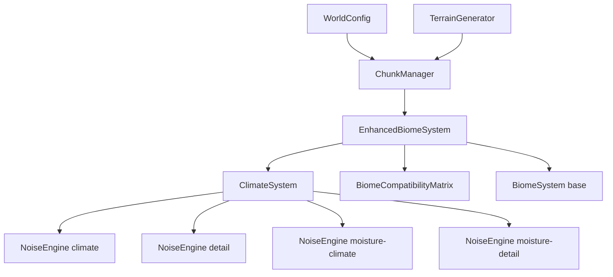
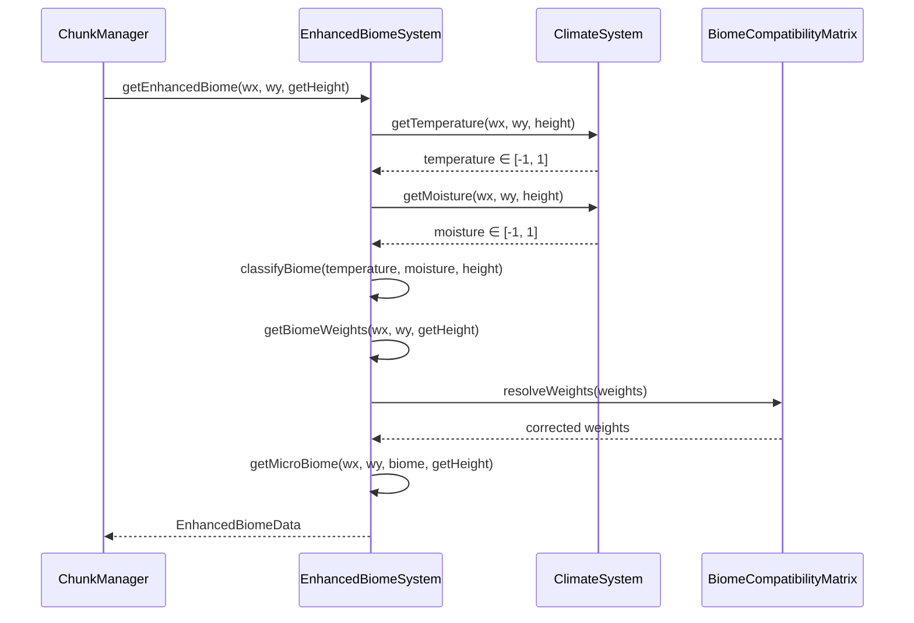

# Design Document: Biome System Improvements

## Overview

This document describes the technical design for improving the procedural world engine's biome system to produce geographically plausible biome distributions. The improvements are delivered as a new `ClimateSystem` class and extensions to `EnhancedBiomeSystem` and `BiomeCompatibilityMatrix`, all opt-in via configuration flags so existing worlds remain unaffected.

The six core improvements are:

1. **Latitudinal temperature gradient** — temperature decreases with increasing world Y (latitude)
2. **Multi-scale climate zones** — large-scale climate noise blended with small-scale detail noise
3. **Altitude-based temperature cooling** — mountains are colder than valleys
4. **Valley moisture accumulation** — flat/valley terrain accumulates more moisture
5. **Biome compatibility matrix** — prevents impossible biome neighbours (e.g. desert ↔ taiga)
6. **Terrain-aware micro-biome placement** — oases in depressions, clearings on flat terrain

All changes are backward-compatible: when the new flags are absent or false, the engine produces bit-identical output to the current implementation.

---

## Architecture

### High-Level Component Relationships



### Data Flow for a Single Tile



### Backward Compatibility Path

When `enhancedBiomeConfig` is absent from `WorldConfig`, `ChunkManager` instantiates the existing `BiomeSystem` directly and the new code is never reached. When `enhancedBiomeConfig` is present but `enableClimateSystem` is false (the default), `EnhancedBiomeSystem` delegates temperature and moisture computation to the parent `BiomeSystem` noise-only path, producing identical results to the current implementation.

---

## Components and Interfaces

### ClimateSystem

A new class in `src/world/climate.ts` responsible for computing climate values (temperature and moisture) that incorporate latitude, altitude, valley shape, and multi-scale noise.

```typescript
export interface ClimateConfig {
  /** Latitude gradient strength [0–1], default 0.5 */
  latitudeGradientStrength: number;
  /** Large-scale climate noise scale, default 0.001 */
  climateScale: number;
  /** Small-scale detail noise scale, default 0.005 */
  detailScale: number;
  /** Detail layer blend weight [0–1], default 0.3 */
  climateDetailBlend: number;
  /** Height threshold above which cooling begins [0–1], default 0.6 */
  altitudeCoolingThreshold: number;
  /** Temperature reduction rate above threshold [0–2], default 1.0 */
  altitudeCoolingRate: number;
  /** Gradient magnitude below which moisture bonus applies [0–1], default 0.05 */
  valleyGradientThreshold: number;
  /** Maximum moisture bonus in flat/valley areas [0–1], default 0.3 */
  valleyMoistureBonus: number;
}

export class ClimateSystem {
  constructor(seed: number, config: ClimateConfig);

  /**
   * Returns temperature ∈ [-1, 1] incorporating latitude gradient,
   * multi-scale noise, and altitude cooling.
   */
  getTemperature(x: number, y: number, height: number): number;

  /**
   * Returns moisture ∈ [-1, 1] incorporating multi-scale noise
   * and valley moisture accumulation.
   * @param getHeight - callback to sample terrain height at neighbouring positions
   */
  getMoisture(
    x: number,
    y: number,
    height: number,
    getHeight: (wx: number, wy: number) => number
  ): number;

  /**
   * Computes terrain gradient magnitude at (x, y) using RMS of
   * height differences to 4 cardinal neighbours at step distance.
   */
  computeGradient(
    x: number,
    y: number,
    getHeight: (wx: number, wy: number) => number,
    step?: number
  ): number;
}
```

**Temperature computation (stack-local, no heap allocation):**

```
latitudeBase  = -y * latitudeGradientStrength / WORLD_HALF_HEIGHT
climateNoise  = climateNoiseEngine.fbm(x, y, { scale: climateScale, ... })
detailNoise   = detailNoiseEngine.fbm(x, y, { scale: detailScale, ... })
blendedNoise  = climateNoise * (1 - climateDetailBlend) + detailNoise * climateDetailBlend
rawTemp       = latitudeBase + blendedNoise * (1 - latitudeGradientStrength)
altitudeDelta = height > altitudeCoolingThreshold
                  ? (height - altitudeCoolingThreshold) * altitudeCoolingRate
                  : 0
temperature   = clamp(rawTemp - altitudeDelta, -1, 1)
```

**Moisture computation (stack-local, no heap allocation):**

```
climateNoise  = moistureClimateEngine.fbm(x, y, { scale: climateScale, ... })
detailNoise   = moistureDetailEngine.fbm(x, y, { scale: detailScale, ... })
blendedNoise  = climateNoise * (1 - climateDetailBlend) + detailNoise * climateDetailBlend
gradient      = computeGradient(x, y, getHeight)
valleyBonus   = gradient < valleyGradientThreshold
                  ? (valleyGradientThreshold - gradient) / valleyGradientThreshold
                    * valleyMoistureBonus
                  : 0
moisture      = clamp(blendedNoise + valleyBonus, -1, 1)
```

**Gradient computation:**

```
dx1 = getHeight(x + step, y) - height
dx2 = getHeight(x - step, y) - height
dy1 = getHeight(x, y + step) - height
dy2 = getHeight(x, y - step) - height
gradient = sqrt((dx1² + dx2² + dy1² + dy2²) / 4)
```

Four cardinal samples are sufficient for performance; the step defaults to 1 world unit.

---

### BiomeCompatibilityMatrix

A new class in `src/world/biome-compatibility.ts` that encodes which biome pairs are geographically compatible and, for incompatible pairs, which intermediate biome must be inserted.

```typescript
export class BiomeCompatibilityMatrix {
  /**
   * Returns true if biomeA and biomeB can be direct neighbours.
   * O(1) lookup via pre-computed flat array indexed by (a * NUM_BIOMES + b).
   */
  isCompatible(a: BiomeType, b: BiomeType): boolean;

  /**
   * Returns the intermediate BiomeType that must appear between
   * an incompatible pair. Returns undefined for compatible pairs.
   * O(1) lookup.
   */
  getIntermediate(a: BiomeType, b: BiomeType): BiomeType | undefined;

  /** Serialises the matrix to a plain JSON-safe object. */
  serialise(): SerializedCompatibilityMatrix;

  /** Deserialises from a plain JSON-safe object. */
  static deserialise(data: SerializedCompatibilityMatrix): BiomeCompatibilityMatrix;
}

export interface SerializedCompatibilityMatrix {
  version: number;
  /** Flat array of length NUM_BIOMES² encoding compatibility (1=compatible, 0=incompatible) */
  compatible: number[];
  /** Flat array of length NUM_BIOMES² encoding intermediate biome index (-1 if none) */
  intermediate: number[];
}
```

**Built-in incompatible pairs (symmetric):**

| Pair | Intermediate |
|------|-------------|
| DESERT ↔ TAIGA | PLAINS |
| DESERT ↔ TUNDRA | PLAINS |
| DESERT ↔ FOREST | PLAINS |
| OCEAN ↔ MOUNTAIN | BEACH |

All other pairs are compatible by default. The matrix is symmetric: `isCompatible(a, b) === isCompatible(b, a)`.

**Weight correction in EnhancedBiomeSystem:**

When `enableCompatibilityMatrix` is true, after computing the standard blend weights, the system iterates over all non-primary biomes in the weight map. For each biome `b` with weight `w` that is incompatible with the primary biome `p`, the weight of `b` is set to 0 and the weight of `getIntermediate(p, b)` is increased by `w`.

---

### EnhancedBiomeConfig Extensions

The existing `EnhancedBiomeConfig` interface gains the following fields:

```typescript
export interface EnhancedBiomeConfig extends BiomeConfig {
  // ... existing fields ...

  /** Activates ClimateSystem for temperature/moisture (default: false) */
  enableClimateSystem?: boolean;
  /** Activates biome compatibility enforcement (default: false) */
  enableCompatibilityMatrix?: boolean;
  /** All ClimateSystem parameters (required when enableClimateSystem is true) */
  climateConfig?: ClimateConfig;
  /** Minimum depression depth for oasis/pond placement (default: 0.05) */
  depressionDepthThreshold?: number;
  /** Maximum gradient for clearing/grove placement (default: 0.03) */
  clearingGradientThreshold?: number;
}
```

All new fields are optional with safe defaults so existing `EnhancedBiomeConfig` objects remain valid without modification.

---

### EnhancedBiomeSystem Changes

`EnhancedBiomeSystem` gains two new private members:

- `climateSystem: ClimateSystem | null` — instantiated when `enableClimateSystem` is true
- `compatibilityMatrix: BiomeCompatibilityMatrix | null` — instantiated when `enableCompatibilityMatrix` is true

**Modified `getEnhancedBiome` flow:**

1. Sample `height = getHeight(x, y)`
2. If `climateSystem` is set: `temperature = climateSystem.getTemperature(x, y, height)`, `moisture = climateSystem.getMoisture(x, y, height, getHeight)`; otherwise delegate to parent `BiomeSystem.getTemperature/getMoisture`
3. Classify biome from `(height, temperature, moisture)` using existing logic
4. Compute blend weights via `getBiomeWeights`
5. If `compatibilityMatrix` is set: apply weight correction
6. Determine micro-biome with terrain-aware placement (see below)
7. Return `EnhancedBiomeData`

**Terrain-aware micro-biome placement:**

The existing `getMicroBiome` method is extended to accept `getHeight` and apply terrain conditions before the noise threshold check:

```
For OASIS (DESERT parent):
  neighbourAvg = average of getHeight at 4 cardinal neighbours
  if (height - neighbourAvg) >= -depressionDepthThreshold → skip (not a depression)

For CLEARING (FOREST parent):
  gradient = climateSystem.computeGradient(x, y, getHeight)  // or inline if no climateSystem
  if gradient >= clearingGradientThreshold → skip

For POND (PLAINS parent):
  same depression check as OASIS

For GROVE (TUNDRA parent):
  same gradient check as CLEARING
```

When `depressionDepthThreshold === 0` and `clearingGradientThreshold === 0`, the terrain conditions are trivially satisfied (any depression depth ≥ 0, any gradient ≥ 0), so placement falls back to noise-only logic — preserving backward compatibility.

---

## Data Models

### ClimateConfig (default values)

```typescript
const DEFAULT_CLIMATE_CONFIG: ClimateConfig = {
  latitudeGradientStrength: 0.5,
  climateScale: 0.001,
  detailScale: 0.005,
  climateDetailBlend: 0.3,
  altitudeCoolingThreshold: 0.6,
  altitudeCoolingRate: 1.0,
  valleyGradientThreshold: 0.05,
  valleyMoistureBonus: 0.3,
};
```

### NoiseEngine Seed Allocation

`ClimateSystem` uses four `NoiseEngine` instances to avoid correlation between layers:

| Engine | Seed offset | Purpose |
|--------|-------------|---------|
| `tempClimate` | `seed + 3000` | Large-scale temperature noise |
| `tempDetail` | `seed + 3001` | Small-scale temperature detail |
| `moistClimate` | `seed + 3002` | Large-scale moisture noise |
| `moistDetail` | `seed + 3003` | Small-scale moisture detail |

Offsets 3000–3003 are chosen to avoid collision with existing offsets (0, +1000, +2000 used by `BiomeSystem` and `EnhancedBiomeSystem`).

### SerializedCompatibilityMatrix

```typescript
interface SerializedCompatibilityMatrix {
  version: 1;
  compatible: number[];   // length: NUM_BIOMES * NUM_BIOMES (8*8=64)
  intermediate: number[]; // length: NUM_BIOMES * NUM_BIOMES, -1 = no intermediate
}
```

Flat arrays are used for O(1) access and trivial JSON serialisation.

### WorldConfig (unchanged)

`WorldConfig` is not modified. All new parameters are nested inside `enhancedBiomeConfig.climateConfig` and the two new boolean flags on `EnhancedBiomeConfig`. Consumers who do not set `enhancedBiomeConfig` are completely unaffected.

---

## Correctness Properties

*A property is a characteristic or behavior that should hold true across all valid executions of a system — essentially, a formal statement about what the system should do. Properties serve as the bridge between human-readable specifications and machine-verifiable correctness guarantees.*

### Property 1: Temperature output is always in range [-1, 1]

*For any* world position (x, y), terrain height h ∈ [0, 1], and valid `ClimateConfig`, `ClimateSystem.getTemperature(x, y, h)` SHALL return a value in the closed interval [−1, 1].

**Validates: Requirements 1.5, 3.5**

---

### Property 2: Moisture output is always in range [-1, 1]

*For any* world position (x, y), terrain height h ∈ [0, 1], height callback, and valid `ClimateConfig`, `ClimateSystem.getMoisture(x, y, h, getHeight)` SHALL return a value in the closed interval [−1, 1].

**Validates: Requirements 4.4**

---

### Property 3: Latitude gradient is monotonically decreasing with Y

*For any* two Y-coordinates y1 < y2 and any `latitudeGradientStrength` > 0, the latitude temperature contribution at y1 SHALL be greater than or equal to the latitude temperature contribution at y2 (all other inputs held constant).

**Validates: Requirements 1.1**

---

### Property 4: Zero latitude gradient strength preserves noise-only temperature

*For any* world position (x, y) and height h, a `ClimateSystem` configured with `latitudeGradientStrength = 0` SHALL return the same temperature as the base `BiomeSystem` noise-only path for the same seed and position.

**Validates: Requirements 1.4**

---

### Property 5: Altitude cooling is monotonically decreasing above threshold

*For any* two heights h1 > h2 > `altitudeCoolingThreshold`, and any world position (x, y), `getTemperature(x, y, h1)` SHALL be less than or equal to `getTemperature(x, y, h2)`.

**Validates: Requirements 3.1**

---

### Property 6: No altitude cooling below threshold

*For any* height h ≤ `altitudeCoolingThreshold` and any world position (x, y), the temperature returned by `ClimateSystem` SHALL be identical to the temperature computed with h = 0 (i.e., altitude cooling contributes exactly zero).

**Validates: Requirements 3.4**

---

### Property 7: Valley moisture bonus is monotonically decreasing with gradient

*For any* two gradient magnitudes g1 < g2 < `valleyGradientThreshold`, the moisture bonus applied at g1 SHALL be greater than or equal to the moisture bonus applied at g2.

**Validates: Requirements 4.2**

---

### Property 8: Zero valley moisture bonus preserves gradient-independent moisture

*For any* world position (x, y) and any two height functions that produce different gradient magnitudes at (x, y), a `ClimateSystem` configured with `valleyMoistureBonus = 0` SHALL return identical moisture values for both.

**Validates: Requirements 4.5**

---

### Property 9: Gradient magnitude is always non-negative

*For any* world position (x, y) and any height callback, `ClimateSystem.computeGradient(x, y, getHeight)` SHALL return a value ≥ 0.

**Validates: Requirements 4.1**

---

### Property 10: Compatibility matrix covers all biome pairs

*For any* two `BiomeType` values a and b, `BiomeCompatibilityMatrix.isCompatible(a, b)` SHALL return a boolean (not throw, not return undefined).

**Validates: Requirements 5.1**

---

### Property 11: Incompatible pairs always have a defined intermediate biome

*For any* two `BiomeType` values a and b where `isCompatible(a, b)` is false, `getIntermediate(a, b)` SHALL return a valid `BiomeType` (not undefined, not the same as a or b).

**Validates: Requirements 5.2**

---

### Property 12: Compatibility matrix serialisation round-trip

*For any* `BiomeCompatibilityMatrix` instance m, `BiomeCompatibilityMatrix.deserialise(m.serialise())` SHALL produce a matrix m′ such that for all BiomeType pairs (a, b): `m′.isCompatible(a, b) === m.isCompatible(a, b)` and `m′.getIntermediate(a, b) === m.getIntermediate(a, b)`.

**Validates: Requirements 5.9**

---

### Property 13: Incompatible biomes have zero weight after compatibility correction

*For any* world position where the primary biome is p and a sampled neighbour biome b is incompatible with p (per the matrix), after weight correction the weight of b SHALL be 0 and the weight of `getIntermediate(p, b)` SHALL have increased by the original weight of b.

**Validates: Requirements 5.3**

---

### Property 14: Depression-type micro-biomes only placed in depressions

*For any* world position (x, y) where `getEnhancedBiome` returns a micro-biome of type OASIS or POND, the local terrain height at (x, y) SHALL be below the average height of its cardinal neighbours by at least `depressionDepthThreshold`.

**Validates: Requirements 6.1, 6.3**

---

### Property 15: Flat-terrain micro-biomes only placed on low-gradient terrain

*For any* world position (x, y) where `getEnhancedBiome` returns a micro-biome of type CLEARING or GROVE, the terrain gradient magnitude at (x, y) SHALL be below `clearingGradientThreshold`.

**Validates: Requirements 6.2, 6.4**

---

### Property 16: ClimateSystem is deterministic

*For any* world position (x, y), height h, height callback, seed, and `ClimateConfig`, calling `getTemperature` and `getMoisture` multiple times with identical arguments SHALL return identical values.

**Validates: Requirements 8.1**

---

## Error Handling

### Invalid Configuration Values

`ClimateSystem` validates its config in the constructor and throws descriptive `Error` instances for out-of-range values:

- `latitudeGradientStrength` outside [0, 1]
- `climateDetailBlend` outside [0, 1]
- `altitudeCoolingThreshold` outside [0, 1]
- `altitudeCoolingRate` outside [0, 2]
- `valleyGradientThreshold` outside [0, 1]
- `valleyMoistureBonus` outside [0, 1]
- `climateScale` or `detailScale` ≤ 0

Validation is performed once at construction time, not per-tile, to avoid performance overhead.

### Missing climateConfig

When `enableClimateSystem` is true but `climateConfig` is absent from `EnhancedBiomeConfig`, `EnhancedBiomeSystem` applies `DEFAULT_CLIMATE_CONFIG` rather than throwing, to minimise friction for consumers who want to opt in with minimal configuration.

### Height Callback Errors

If the `getHeight` callback throws, the exception propagates naturally. `ClimateSystem` does not catch or suppress errors from the callback, as the caller (ChunkManager) already handles terrain generation errors.

### Numeric Edge Cases

- `NaN` or `Infinity` inputs to `getTemperature`/`getMoisture` are handled by the underlying `NoiseEngine.noise2D` which returns 0 for non-finite coordinates. The clamping step ensures the output remains in [-1, 1].
- Division by zero in the valley bonus formula is prevented because `valleyGradientThreshold` is validated to be > 0 when `valleyMoistureBonus` > 0.

---

## Testing Strategy

### Unit Tests (example-based)

Located in `src/world/climate.test.ts` and `src/world/biome-compatibility.test.ts`:

- Verify `ClimateConfig` default values
- Verify specific incompatible pairs return the correct intermediate biome (DESERT↔TAIGA→PLAINS, etc.)
- Verify that `enableClimateSystem: false` produces output identical to the existing `BiomeSystem`
- Verify that `enableCompatibilityMatrix: false` produces weights identical to the existing `EnhancedBiomeSystem`
- Verify constructor throws on invalid config values
- Verify `DEFAULT_CLIMATE_CONFIG` is applied when `climateConfig` is absent

### Property-Based Tests (fast-check)

Located in `tests/property/biome-system-improvements.test.ts`. Each property test runs a minimum of 100 iterations.

The project uses **Vitest** with **fast-check 3.15+** for property-based testing.

**Tag format:** `// Feature: biome-system-improvements, Property N: <property_text>`

Property tests to implement:

| Property | fast-check arbitraries |
|----------|----------------------|
| P1: Temperature in [-1,1] | `fc.float`, `fc.record` for config |
| P2: Moisture in [-1,1] | same |
| P3: Latitude monotonicity | `fc.tuple(fc.float, fc.float)` for y1<y2 |
| P4: Zero gradient = noise-only | `fc.float` for position |
| P5: Altitude cooling monotonicity | `fc.tuple` for h1>h2>threshold |
| P6: No cooling below threshold | `fc.float` for h ≤ threshold |
| P7: Valley bonus monotonicity | `fc.tuple` for g1<g2<threshold |
| P8: Zero bonus = gradient-independent | `fc.float` for position |
| P9: Gradient ≥ 0 | `fc.float` for position |
| P10: Matrix covers all pairs | `fc.constantFrom(...BiomeType values)` |
| P11: Incompatible pairs have intermediate | same |
| P12: Serialisation round-trip | fixed matrix instance |
| P13: Incompatible biomes zeroed | constructed scenario |
| P14: Depression micro-biomes in depressions | `fc.float` for position |
| P15: Flat micro-biomes on low gradient | `fc.float` for position |
| P16: Determinism | `fc.float` for position |

**Property reflection — redundancy elimination:**

- P1 and P2 are kept separate because temperature and moisture have different computation paths (altitude cooling only affects temperature; valley bonus only affects moisture).
- P5 (altitude cooling monotonicity) subsumes P6 (no cooling below threshold) as a special case, but P6 is kept as a distinct property because it tests the exact zero-contribution boundary condition, which is a common off-by-one error site.
- P14 (depression micro-biomes) covers both OASIS and POND since they share the same terrain condition; P15 (flat micro-biomes) covers both CLEARING and GROVE.
- P3 (latitude monotonicity) and P4 (zero gradient = noise-only) are complementary: P3 tests the gradient is applied correctly, P4 tests the zero-gradient edge case.
- P10 and P11 are kept separate: P10 tests completeness (no undefined), P11 tests correctness of the intermediate value.

### Integration / Performance Tests

Located in `tests/integration/biome-system-improvements.test.ts`:

- **Performance benchmark**: Generate a 32×32 chunk with all new features enabled; assert completion in < 100 ms. Run 3 times and take the median to reduce noise.
- **End-to-end biome map**: Generate a chunk with known seed and config; assert the biome map matches a stored snapshot to catch regressions.
- **Backward compatibility**: Generate the same chunk with and without `enhancedBiomeConfig`; assert the biome maps are identical when using the base `BiomeSystem` path.

### Smoke Tests

- Verify `BiomeCompatibilityMatrix` lookup table is pre-computed at construction (not lazily) by checking that `isCompatible` returns immediately without computation.
- Verify `ClimateSystem` hot path allocates no objects (manual inspection / heap snapshot in development).
