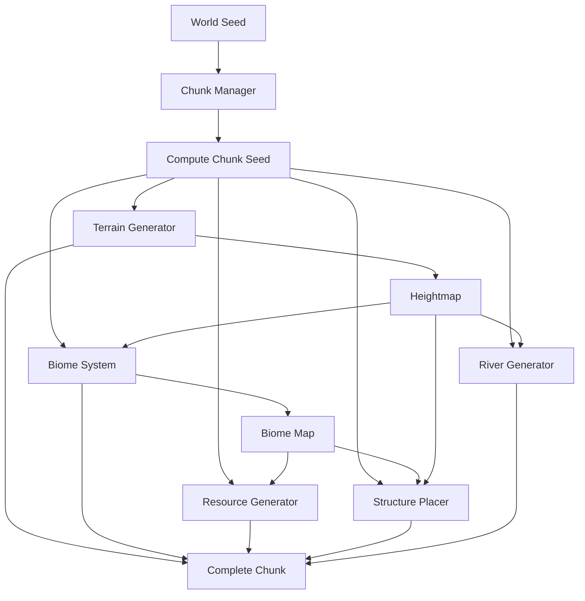

# Design Document: Procedural World Engine

## Overview

The Procedural World Engine is a TypeScript-based system for generating infinite, deterministic worlds in browser environments. The engine uses seed-based random number generation, multi-layer noise functions, and chunk-based architecture to create realistic terrain, biomes, resources, structures, and river networks.

The design prioritizes:
- **Determinism**: Same seed always produces same world
- **Performance**: Efficient chunk-based generation suitable for browsers
- **Modularity**: Clean separation of concerns for maintainability
- **Extensibility**: Easy to add new generators and features

## Architecture

### High-Level Structure

```
procedural-world-engine/
├── src/
│   ├── core/
│   │   ├── rng.ts           # Deterministic RNG
│   │   ├── noise.ts         # Noise functions (Perlin/Simplex, fBM)
│   │   └── hash.ts          # Hashing utilities
│   ├── world/
│   │   ├── chunk.ts         # Chunk data structure
│   │   ├── chunk-manager.ts # Chunk generation coordinator
│   │   └── biome.ts         # Biome classification and blending
│   ├── gen/
│   │   ├── terrain.ts       # Terrain heightmap generation
│   │   ├── resources.ts     # Resource cluster generation
│   │   ├── structures.ts    # Structure placement
│   │   └── rivers.ts        # River network generation
│   ├── utils/
│   │   └── poisson.ts       # Poisson Disk Sampling
│   └── index.ts             # Main API
```

### Data Flow



### Generation Pipeline

For each chunk at coordinates (chunkX, chunkY):

1. **Seed Derivation**: `chunkSeed = hash(worldSeed, chunkX, chunkY)`
2. **Terrain Generation**: Generate heightmap using fBM with domain warping
3. **Biome Classification**: Compute temperature/moisture maps, determine biomes
4. **Resource Distribution**: Place resource clusters based on biome and noise
5. **Structure Placement**: Use Poisson Disk Sampling with rule-based filtering
6. **River Generation**: Trace downhill flow paths from high elevations

## Components and Interfaces

### Core Module

#### RNG (Random Number Generator)

```typescript
class SeededRNG {
  constructor(seed: number);
  
  // Generate random integer in range [min, max)
  nextInt(min: number, max: number): number;
  
  // Generate random float in range [0, 1)
  nextFloat(): number;
  
  // Create a new RNG with derived seed
  derive(offset: number): SeededRNG;
}
```

**Implementation**: Use a well-tested algorithm like xorshift128+ or mulberry32 for speed and quality.

#### Noise Engine

```typescript
interface NoiseConfig {
  octaves: number;
  persistence: number;
  lacunarity: number;
  scale: number;
}

class NoiseEngine {
  constructor(seed: number);
  
  // Basic 2D noise [-1, 1]
  noise2D(x: number, y: number): number;
  
  // Fractional Brownian Motion
  fbm(x: number, y: number, config: NoiseConfig): number;
  
  // Domain warping
  domainWarp(x: number, y: number, strength: number): [number, number];
}
```

**Implementation**: Use Simplex noise for better performance than Perlin. Implement fBM by summing multiple octaves with decreasing amplitude.

#### Hash Utilities

```typescript
// Combine multiple values into a single hash
function hash(...values: number[]): number;

// Generate chunk seed from world seed and coordinates
function chunkSeed(worldSeed: number, chunkX: number, chunkY: number): number;
```

### World Module

#### Chunk Data Structure

```typescript
interface ChunkData {
  x: number;
  y: number;
  size: number;
  heightmap: Float32Array;      // size * size
  biomeMap: Uint8Array;          // size * size
  biomeWeights: Float32Array;    // size * size * numBiomes
  resources: Resource[];
  structures: Structure[];
  rivers: Set<number>;           // Flat indices of river tiles
}

interface Resource {
  x: number;
  y: number;
  type: ResourceType;
  amount: number;
}

interface Structure {
  x: number;
  y: number;
  type: StructureType;
}

enum ResourceType {
  IRON = 0,
  GOLD = 1,
  COAL = 2,
  STONE = 3,
  WOOD = 4,
}

enum StructureType {
  VILLAGE = 0,
  RUINS = 1,
  TOWER = 2,
}
```

#### Chunk Manager

```typescript
interface WorldConfig {
  seed: number;
  chunkSize: number;
  terrainConfig: TerrainConfig;
  biomeConfig: BiomeConfig;
}

class ChunkManager {
  constructor(config: WorldConfig);
  
  // Generate or retrieve cached chunk
  getChunk(chunkX: number, chunkY: number): ChunkData;
  
  // Generate chunk without caching
  generateChunk(chunkX: number, chunkY: number): ChunkData;
  
  // Clear chunk cache
  clearCache(): void;
}
```

**Caching Strategy**: Use LRU cache with configurable size limit. For browser usage, consider storing recently accessed chunks.

#### Biome System

```typescript
enum BiomeType {
  OCEAN = 0,
  BEACH = 1,
  DESERT = 2,
  PLAINS = 3,
  FOREST = 4,
  TAIGA = 5,
  TUNDRA = 6,
  MOUNTAIN = 7,
}

interface BiomeConfig {
  temperatureScale: number;
  moistureScale: number;
  blendRadius: number;
}

class BiomeSystem {
  constructor(seed: number, config: BiomeConfig);
  
  // Get biome at world position
  getBiome(x: number, y: number, height: number): BiomeType;
  
  // Get biome blend weights for smooth transitions
  getBiomeWeights(x: number, y: number, height: number): Map<BiomeType, number>;
  
  // Generate temperature value [-1, 1]
  getTemperature(x: number, y: number): number;
  
  // Generate moisture value [-1, 1]
  getMoisture(x: number, y: number): number;
}
```

**Biome Classification Logic**:
- Height < 0.3: Ocean
- Height < 0.35: Beach
- Height > 0.7: Mountain
- Otherwise: Use temperature/moisture to determine Plains, Desert, Forest, Taiga, Tundra

**Blending**: Use distance-based interpolation within `blendRadius` of biome boundaries.

### Generation Module

#### Terrain Generator

```typescript
interface TerrainConfig {
  baseScale: number;
  octaves: number;
  persistence: number;
  lacunarity: number;
  warpStrength: number;
  heightMultiplier: number;
}

class TerrainGenerator {
  constructor(config: TerrainConfig);
  
  // Generate heightmap for chunk
  generateHeightmap(chunkSeed: number, chunkSize: number): Float32Array;
  
  // Get height at specific world position
  getHeight(x: number, y: number, seed: number): number;
}
```

**Algorithm**:
1. Apply domain warping to (x, y) coordinates
2. Sample fBM noise at warped coordinates
3. Apply height multiplier and normalization
4. Return height value in range [0, 1]

#### Resource Generator

```typescript
interface ResourceConfig {
  types: ResourceTypeConfig[];
  clusterScale: number;
  densityThreshold: number;
}

interface ResourceTypeConfig {
  type: ResourceType;
  rarity: number;
  biomes: BiomeType[];
  minAmount: number;
  maxAmount: number;
}

class ResourceGenerator {
  constructor(config: ResourceConfig);
  
  // Generate resources for chunk
  generateResources(
    chunkData: ChunkData,
    chunkSeed: number
  ): Resource[];
}
```

**Algorithm**:
1. For each resource type, generate a noise map using `chunkSeed + resourceType`
2. For each tile, if noise > `densityThreshold` and biome matches, place resource
3. Use RNG to determine resource amount within configured range
4. This creates natural clusters where noise values are high

#### Structure Placer

```typescript
interface StructureConfig {
  types: StructureTypeConfig[];
  minDistance: number;
  maxAttempts: number;
}

interface StructureTypeConfig {
  type: StructureType;
  rarity: number;
  rules: PlacementRule[];
}

interface PlacementRule {
  type: 'biome' | 'slope' | 'nearWater' | 'elevation';
  params: any;
}

class StructurePlacer {
  constructor(config: StructureConfig);
  
  // Generate structures for chunk
  generateStructures(
    chunkData: ChunkData,
    chunkSeed: number
  ): Structure[];
}
```

**Algorithm**:
1. Use Poisson Disk Sampling to generate candidate positions with minimum spacing
2. For each candidate, evaluate all placement rules
3. If all rules pass, place structure of appropriate type based on rarity weights
4. Use `chunkSeed` to initialize Poisson sampling for determinism

**Placement Rules**:
- **Biome**: Structure must be in allowed biome list
- **Slope**: Terrain slope must be below threshold (flat areas)
- **Near Water**: Must be within distance of river or ocean
- **Elevation**: Height must be within specified range

#### River Generator

```typescript
interface RiverConfig {
  sourceElevation: number;
  minFlowLength: number;
  flowWidth: number;
}

class RiverGenerator {
  constructor(config: RiverConfig);
  
  // Generate rivers for chunk
  generateRivers(
    chunkData: ChunkData,
    chunkSeed: number
  ): Set<number>;
}
```

**Algorithm**:
1. Use RNG with `chunkSeed` to select potential river sources (high elevation tiles)
2. For each source, trace downhill path:
   - Find steepest descent among 8 neighbors
   - Mark current tile as river
   - Continue until reaching ocean level or local minimum
3. Only keep rivers longer than `minFlowLength`
4. Apply `flowWidth` to widen river paths

**Optimization**: Rivers may span multiple chunks. Consider generating rivers at world level and caching results, or use chunk boundaries carefully.

### Utilities

#### Poisson Disk Sampling

```typescript
interface PoissonConfig {
  width: number;
  height: number;
  minDistance: number;
  maxAttempts: number;
  seed: number;
}

function poissonDiskSampling(config: PoissonConfig): Array<{x: number, y: number}>;
```

**Algorithm**: Bridson's algorithm
1. Initialize grid for spatial lookup
2. Start with random seed point
3. Generate candidates around active points
4. Accept candidates that maintain minimum distance
5. Use seeded RNG for determinism

## Data Models

### Chunk Coordinate System

- **World Space**: Continuous coordinates (x, y) in world units
- **Chunk Space**: Discrete chunk coordinates (chunkX, chunkY)
- **Local Space**: Coordinates within a chunk [0, chunkSize)

**Conversions**:
```typescript
function worldToChunk(worldX: number, worldY: number, chunkSize: number): [number, number] {
  return [Math.floor(worldX / chunkSize), Math.floor(worldY / chunkSize)];
}

function chunkToWorld(chunkX: number, chunkY: number, chunkSize: number): [number, number] {
  return [chunkX * chunkSize, chunkY * chunkSize];
}

function worldToLocal(worldX: number, worldY: number, chunkSize: number): [number, number] {
  return [
    ((worldX % chunkSize) + chunkSize) % chunkSize,
    ((worldY % chunkSize) + chunkSize) % chunkSize
  ];
}
```

### Memory Layout

For a chunk of size N×N:
- **Heightmap**: Float32Array of length N² (4 bytes per tile)
- **Biome Map**: Uint8Array of length N² (1 byte per tile)
- **Biome Weights**: Float32Array of length N² × B where B = number of biomes
- **Resources**: Array of objects (variable size)
- **Structures**: Array of objects (variable size)
- **Rivers**: Set of flat indices (variable size)

**Total memory per chunk** (N=32, B=8): ~20KB + variable structures/resources


## Correctness Properties

A property is a characteristic or behavior that should hold true across all valid executions of a system—essentially, a formal statement about what the system should do. Properties serve as the bridge between human-readable specifications and machine-verifiable correctness guarantees.

### Property 1: RNG Determinism

*For any* seed value, creating two RNG instances with the same seed and calling the same sequence of operations should produce identical sequences of random numbers.

**Validates: Requirements 1.2**

### Property 2: RNG Float Range

*For any* sequence of calls to nextFloat(), all returned values should be in the range [0, 1).

**Validates: Requirements 1.5**

### Property 3: Chunk Seed Uniqueness

*For any* two different chunk coordinates (x1, y1) and (x2, y2) with the same world seed, the computed chunk seeds should be different.

**Validates: Requirements 2.2**

### Property 4: Chunk Generation Determinism

*For any* chunk coordinates and world seed, generating the same chunk multiple times should produce identical chunk data (heightmap, biomes, resources, structures, rivers).

**Validates: Requirements 2.3**

### Property 5: Chunk Independence

*For any* chunk coordinates, generating that chunk should succeed without requiring adjacent chunks to be generated first.

**Validates: Requirements 2.4**

### Property 6: Heightmap Size Correctness

*For any* generated chunk with configured size N, the heightmap array should have exactly N² elements.

**Validates: Requirements 3.3**

### Property 7: Terrain Generation Determinism

*For any* chunk seed and terrain configuration, generating terrain twice should produce identical heightmaps.

**Validates: Requirements 3.4**

### Property 8: Resource-Biome Matching

*For any* generated resource in a chunk, the resource type should be valid for the biome at that resource's position.

**Validates: Requirements 5.3**

### Property 9: Resource Generation Determinism

*For any* chunk seed and resource configuration, generating resources twice should produce identical resource lists (same positions, types, and amounts).

**Validates: Requirements 5.4**

### Property 10: Structure Minimum Distance

*For any* pair of structures in a generated chunk, the distance between them should be at least the configured minimum distance.

**Validates: Requirements 6.2**

### Property 11: Structure Placement Rules

*For any* generated structure in a chunk, the structure's position should satisfy all configured placement rules (biome suitability, terrain slope, elevation, proximity to water).

**Validates: Requirements 6.3**

### Property 12: Structure Generation Determinism

*For any* chunk seed and structure configuration, generating structures twice should produce identical structure lists (same positions and types).

**Validates: Requirements 6.5**

### Property 13: River Downhill Flow

*For any* river segment in a generated chunk, each step along the river path should move to a position with equal or lower elevation than the previous position.

**Validates: Requirements 7.2**

### Property 14: River Termination Conditions

*For any* river endpoint in a generated chunk, the endpoint should either be at ocean level (height < ocean threshold) or at a local minimum (no lower neighbors).

**Validates: Requirements 7.3**

### Property 15: River Generation Determinism

*For any* chunk seed and river configuration, generating rivers twice should produce identical river paths (same set of river tile positions).

**Validates: Requirements 7.5**

### Property 16: Noise Generation Determinism

*For any* seed value and coordinate pair (x, y), generating noise at those coordinates twice should produce identical values.

**Validates: Requirements 10.4**

## Error Handling

### RNG Errors

- **Invalid Seed**: If seed is NaN or infinite, throw `InvalidSeedError`
- **Invalid Range**: If min >= max in nextInt(), throw `InvalidRangeError`

### Chunk Generation Errors

- **Invalid Chunk Size**: If chunkSize <= 0, throw `InvalidChunkSizeError`
- **Invalid Coordinates**: If chunk coordinates are NaN or infinite, throw `InvalidCoordinatesError`

### Noise Generation Errors

- **Invalid Config**: If octaves < 1 or persistence/lacunarity <= 0, throw `InvalidNoiseConfigError`
- **Invalid Coordinates**: If x or y are NaN or infinite, return 0 (graceful degradation)

### Resource/Structure Generation Errors

- **Invalid Biome**: If biome type is out of range, throw `InvalidBiomeError`
- **Invalid Resource Type**: If resource type is undefined, throw `InvalidResourceTypeError`
- **Invalid Structure Type**: If structure type is undefined, throw `InvalidStructureTypeError`

### General Error Handling Strategy

1. **Validate inputs early**: Check parameters at API boundaries
2. **Fail fast**: Throw errors for invalid configurations during initialization
3. **Graceful degradation**: For coordinate-based queries, return safe defaults rather than crashing
4. **Detailed error messages**: Include context (seed, coordinates, config) in error messages

## Testing Strategy

### Dual Testing Approach

The testing strategy employs both unit tests and property-based tests as complementary approaches:

- **Unit tests**: Verify specific examples, edge cases, and error conditions
- **Property tests**: Verify universal properties across all inputs using randomized testing

Together, these approaches provide comprehensive coverage: unit tests catch concrete bugs in specific scenarios, while property tests verify general correctness across the input space.

### Property-Based Testing

**Library Selection**: Use **fast-check** for TypeScript property-based testing. It provides excellent TypeScript integration, good performance, and comprehensive generators.

**Configuration**:
- Each property test should run a minimum of **100 iterations** to ensure adequate coverage
- Each test must include a comment tag referencing the design property:
  ```typescript
  // Feature: procedural-world-engine, Property 1: RNG Determinism
  ```

**Property Test Implementation**:
- Each correctness property listed above must be implemented as a single property-based test
- Tests should use fast-check's generators to create random inputs (seeds, coordinates, configurations)
- Tests should verify the property holds for all generated inputs

### Unit Testing

**Focus Areas**:
- **Specific examples**: Test known seed values that produce expected patterns
- **Edge cases**: Test boundary conditions (chunk boundaries, extreme coordinates, min/max values)
- **Error conditions**: Test that invalid inputs produce appropriate errors
- **Integration points**: Test that components work together correctly

**Balance**: Avoid writing too many unit tests for scenarios that property tests already cover. Focus unit tests on concrete examples that demonstrate correct behavior and edge cases that are hard to generate randomly.

### Test Organization

```
tests/
├── unit/
│   ├── core/
│   │   ├── rng.test.ts
│   │   ├── noise.test.ts
│   │   └── hash.test.ts
│   ├── world/
│   │   ├── chunk.test.ts
│   │   ├── chunk-manager.test.ts
│   │   └── biome.test.ts
│   └── gen/
│       ├── terrain.test.ts
│       ├── resources.test.ts
│       ├── structures.test.ts
│       └── rivers.test.ts
└── property/
    ├── rng.property.test.ts
    ├── chunk.property.test.ts
    ├── terrain.property.test.ts
    ├── resources.property.test.ts
    ├── structures.property.test.ts
    ├── rivers.property.test.ts
    └── noise.property.test.ts
```

### Example Property Test

```typescript
import fc from 'fast-check';

// Feature: procedural-world-engine, Property 1: RNG Determinism
test('RNG produces identical sequences for same seed', () => {
  fc.assert(
    fc.property(
      fc.integer(), // seed
      fc.nat(100),  // number of calls
      (seed, numCalls) => {
        const rng1 = new SeededRNG(seed);
        const rng2 = new SeededRNG(seed);
        
        const sequence1 = Array.from({ length: numCalls }, () => rng1.nextFloat());
        const sequence2 = Array.from({ length: numCalls }, () => rng2.nextFloat());
        
        expect(sequence1).toEqual(sequence2);
      }
    ),
    { numRuns: 100 }
  );
});
```

### Example Unit Test

```typescript
test('RNG generates values in valid range', () => {
  const rng = new SeededRNG(12345);
  
  for (let i = 0; i < 1000; i++) {
    const value = rng.nextFloat();
    expect(value).toBeGreaterThanOrEqual(0);
    expect(value).toBeLessThan(1);
  }
});

test('Chunk generation handles edge case at origin', () => {
  const manager = new ChunkManager({ seed: 0, chunkSize: 32 });
  const chunk = manager.getChunk(0, 0);
  
  expect(chunk.x).toBe(0);
  expect(chunk.y).toBe(0);
  expect(chunk.heightmap.length).toBe(32 * 32);
});
```

### Testing Priorities

1. **Critical Path**: RNG determinism, chunk generation determinism, coordinate conversions
2. **Core Algorithms**: Noise generation, terrain generation, biome classification
3. **Placement Logic**: Resource clustering, structure placement rules, river flow
4. **Edge Cases**: Chunk boundaries, extreme coordinates, empty chunks
5. **Error Handling**: Invalid inputs, configuration errors

### Web Worker Testing

For Web Worker compatibility (Requirement 9.2), include integration tests that:
1. Instantiate the engine in a Web Worker context
2. Send generation requests via postMessage
3. Verify results are correctly serialized and returned
4. Confirm no shared state issues between worker and main thread
